# Explainable Image Captioning

The goal of image captioning is to convert a given input image into a natural language description.
In this appart from generating captions we will also show the regions where the model looks to generate
a perticular word, through attention mechanism.<br>

In this project I have implemented the [Show, Attend and Tell Paper](https://arxiv.org/abs/1502.03044). Using
[Pytorch](https://github.com/pytorch/pytorch)
deep learning library.
## New Streamlit APP
This project is now deployed as a streamlit app.<br>
### Instructions to Use:
```python
git clone https://github.com/mrFahrenhiet/Explainable_Image_Caption_bot.git
pip install -r requirements.txt
```

```python
# Note weights will get automatically downloaded.
# If you have already downloaded, just place 
# in the path and make the changes in app_streamlit file also

streamlit run app_streamlit.py # Run the app on local machine
```
### App Screenshorts

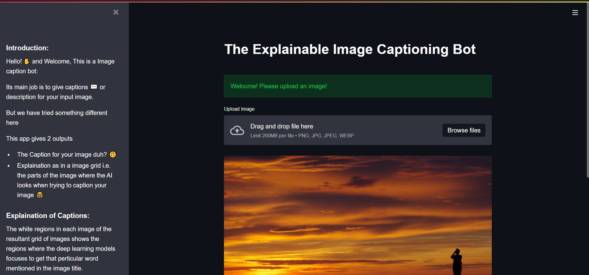

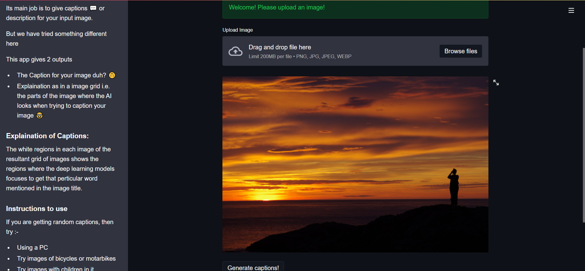


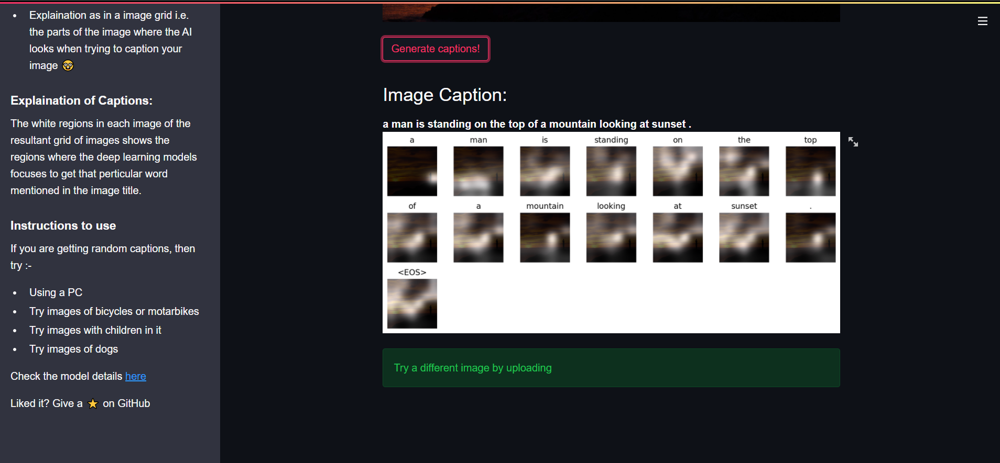

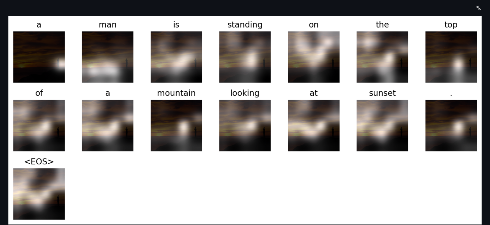


## Overview
In this project I have implemented the [Show, Attend and Tell Paper](https://arxiv.org/abs/1502.03044)
This is not the current state-of-the-art, but is amazing <br>

***This model learns where to look.***

As you generate a caption, word by word, you can see the model's gaze shifting across the image.

This is possible because of its Attention mechanism, which allows it to focus on the part of the image most relevant to the word it is going to utter next.

Here are some captions generated on test images not seen during training or validation:

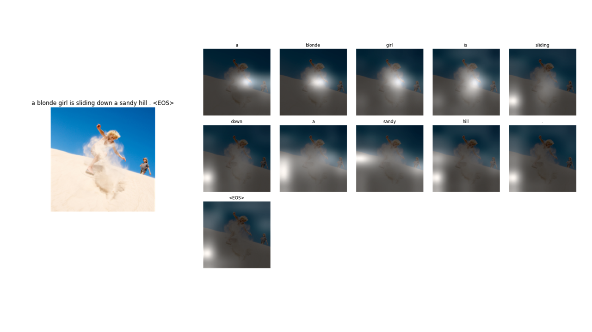

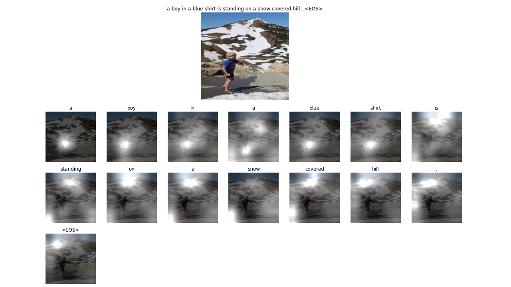

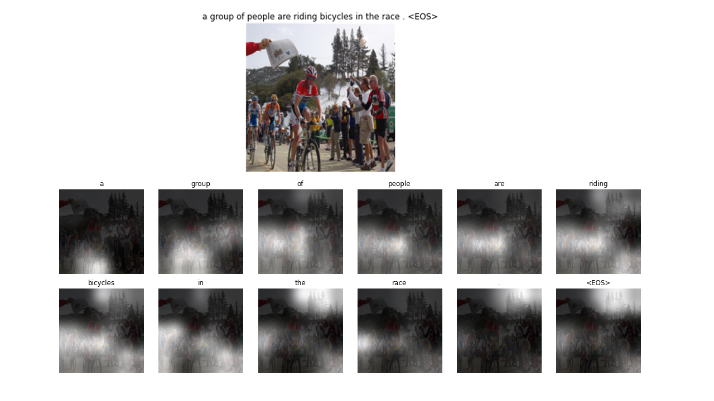

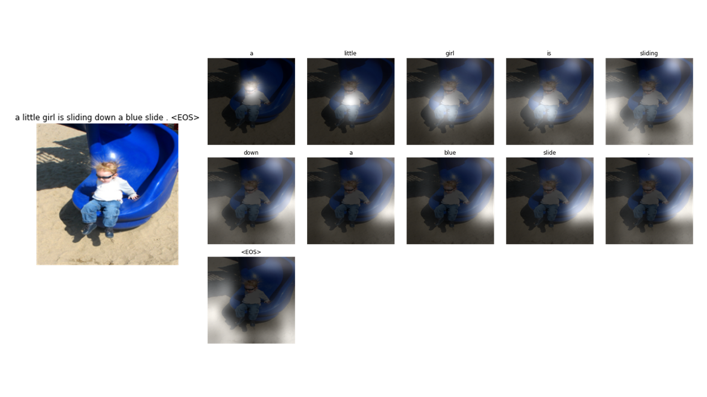

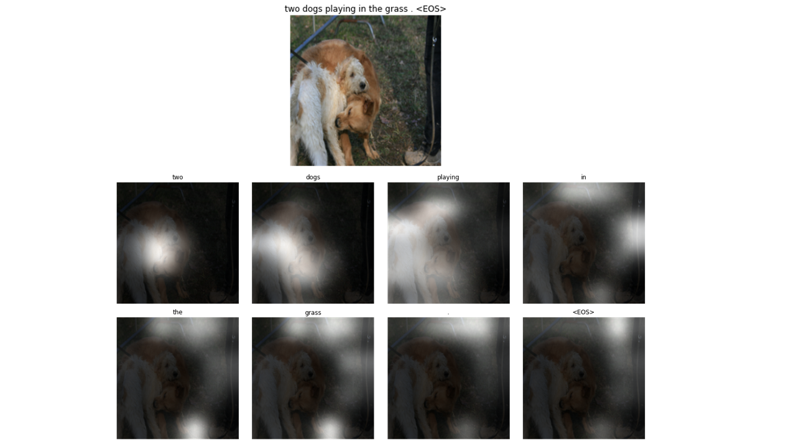


## Model Description
The model basically has 3 parts :-
- Encoder: We encode the image in 49 x 2048 size vector using a pretrained ResNet-50 architechture
- Attention: attention make use of 49 layers of encoded image to calculate context vectors
  which are to be passed on to the decoder.
- Decoder: Each LSTM cell in the decoder recieves the context vector and given that, and 
the previous word predicted the decoder tries to predict the next word of the caption.

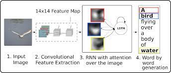<br>
*Credits: Show, Attend and Tell paper*


## Dataset Description
For this implementation I used the flickr8k dataset which contains a total of
8091 images and every image has 5 captions. For training, we used 7511 images and for
validation we used 580 images. The results section gives a breif about the results we obtained and
the metrics we used for evaluation.

## Results
The metrics used for evaluation were cross entropy loss and BLEU score. The loss was used for both training and validation.
I calculated the BLEU score over 580 images with 5 captions each. The model was trained for 50 epochs the best result
was achieved in the 45th epoch. The graphs below explains the decrement of training and validation loss over the course
of training the model.

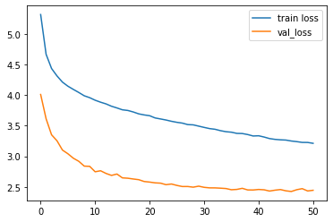

The table belows shows the BLUE score our model obtained during the testing phase.
The bleu score implementation can be found in this [jupyter notebook](https://colab.research.google.com/drive/1v6O3u3psYxBswR51HPIcSbMzjQFMhbsp?usp=sharing)

### Flickr8K model 

| Torch metric | Score   |
|--------------|---------|
| BLEU-1       |  0.53515 |
| BLEU-2       |  0.35395 |
| BLEU-3       |  0.23636 |
| BLEU-4       |  0.15749 |


## Colab Notebooks and Datasets
The colab notebooks used for training procedures and datasets used in the development
of this project can be found [here](https://drive.google.com/drive/folders/1JMdBNklNe7-4VWiVTUNtTQQVGX4LGZGL?usp=sharing)


## Pretrained Model
If you do not want to train the model from scratch, you can use a pretrained model.
You can download the pretrained model and vocab state_checkpoint file from
[here](https://drive.google.com/file/d/1-AIlZp28kvn13sEGJpD1vJY10aBuBg2a/view?usp=sharing)


## Future Work
 - Implementing beam search at test phase
 - Implementing the whole network architecture using transformers
 - Using Flickr30k dataset and MS COCO dataset for training and evaluatuion.
