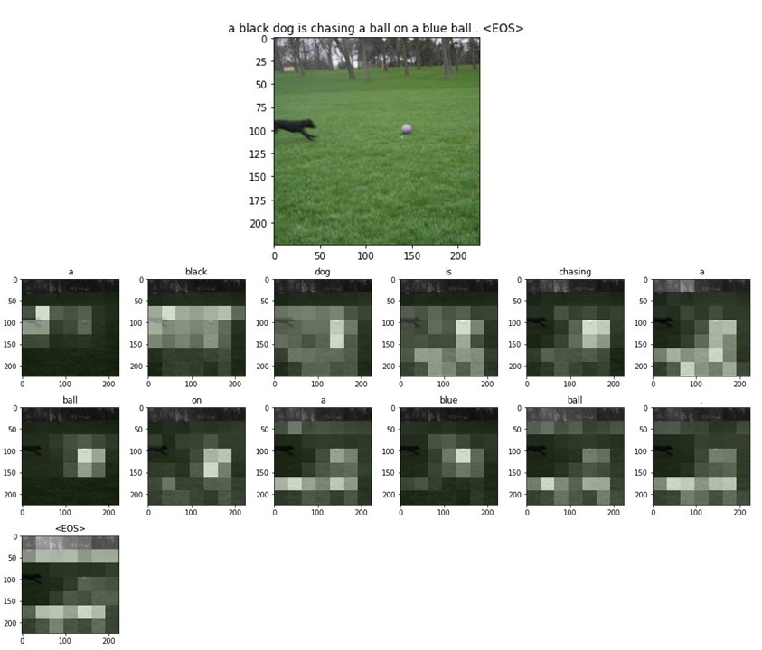
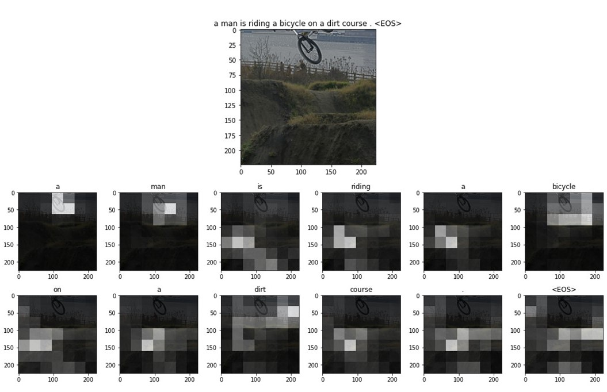
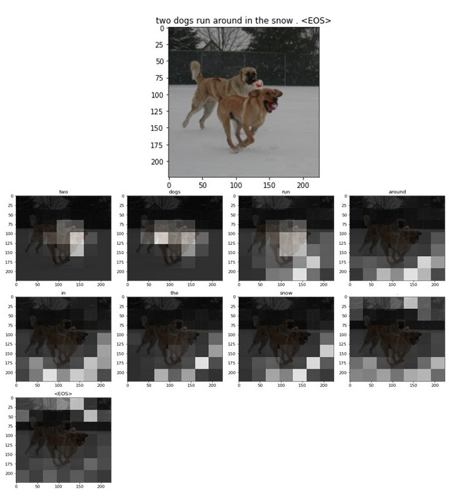

# Explainable Image Captioning

The goal of image captioning is to convert a given input image into a natural language description.
In this appart from generating captions we will also show the regions where the model looks to generate
a perticular word, through attention mechanism. 

In this project I have implemented the [Show, Attend and Tell Paper](https://arxiv.org/abs/1502.03044). Using
[Pytorch](https://github.com/pytorch/pytorch)
deep learning library.

## Overview
In this project I have implemented the [Show, Attend and Tell Paper](https://arxiv.org/abs/1502.03044)
This is not the current state-of-the-art, but is amazing  

***This model learns where to look.***

As you generate a caption, word by word, you can see the model's gaze shifting across the image.

This is possible because of its Attention mechanism, which allows it to focus on the part of the image most relevant to the word it is going to utter next.

Here are some captions generated on test images not seen during training or validation:

## Model Description
The model basically has 3 parts :-
- Encoder: We encode the image in 49 x 2048 size vector
- Attention: attention make use of 49 layers of encoded image to calculate context vectors
  which are to be passed on to the decoder.
- Decoder: Each LSTM cell in the decoder recieves the context vector and given that and 
the previous word predicted the decoder tries to predict the next word of the caption.

 
*Credits: Show, Attend and Tell paper*

## Dataset Description
**TO DO**

## Colab Notebooks and Datasets
The colab notebooks used for training procedures and datasets used in the development
of this project can be found [here](https://drive.google.com/drive/folders/1JMdBNklNe7-4VWiVTUNtTQQVGX4LGZGL?usp=sharing)

## Pretrained Model
If you do not want to train the model from scratch, you can use a pretrained model.
You can download the pretrained model and vocab state_checkpoint file from
[here](https://drive.google.com/file/d/1-AIlZp28kvn13sEGJpD1vJY10aBuBg2a/view?usp=sharing)
